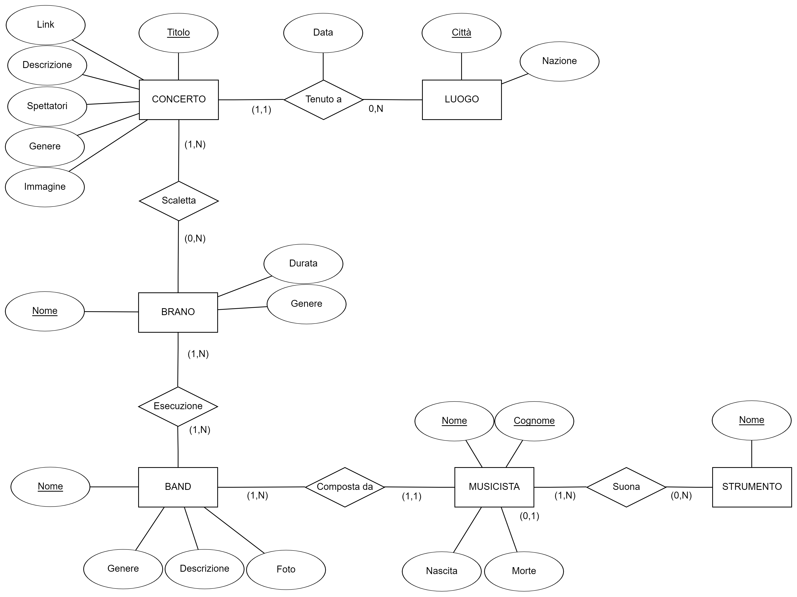

<!-- PROJECT LOGO -->
   
    

    
  </a>
  <h1 align="center">ConcertEdia</h1>
  

    PHP, Bootstrap, CSS and SQL website that shows info about past concerts, venues and musicians.  
    Created for a course at University of Parma.
  

  

    <a href="https://concertedia.mattiaricci.it/" target="_blank" align="center">Live Demo</a>
  

  
  <!-- TABLE OF CONTENTS -->
  # Table of Contents
  
  - [Table of Contents](#table-of-contents)
  - [About The Project](#about-the-project)
  - [Features](#features)
    - [Concerts](#concerts)
    - [Bands](#bands)
    - [Search](#search)
    - [Curiosity](#curiosity)
    - [Dark Mode](#dark-mode)
  - [Database](#database)
    - [ER Diagram](#er-diagram)
    - [Logic Scheme](#logic-scheme)
  - [License](#license)
  - [Contributors](#contributors)

# About The Project

ConcertEdia is a PHP, Boostrap, CSS and just a little bit of Javascript website that uses SQL queries to show nice to know informations about past concerts, venues and musicians, including photos, dates and fun facts.
Is all you are looking for if you want to relive a historic concert. Let yourself be lulled by the descriptions of the greatest music experts, explore the great stages of the history of music and hear the hits of the past.  
Let's rock! 🎸

# Features

You can view the following information:

- **Concerts:** just click on your preferred concert in the carousel found in the `concerti.php` page.
- **Bands:** just click on you favorite band's card found in the `band.php` page.
- **Curiosity:** just click on the Navbar's button and see some curiosities about concerts and bands

Follows an example of both concerts and bands.

## Concerts

Find the details about your favorite concert.

	
	<em>Example of concert.</em>

## Bands

Find the details about your favorite band.

	
	<em>Example of band.</em>

## Search

You can search for your favorite band or concert by using the searchbar, located on the top right of the screen, inside the navbar.
Just type what you looking for and press `enter`, if the record exists you'll be redirected to the corresponding page, otherwise _Lionel Richie_ will greet you with an error message.

## Curiosity

We'crafted a curiosity page so you too can know all the fun facts about your favorite band or concert.

	
	<em>The curiosity page.</em>

## Dark Mode

By pressing **+** on your keyboard you will activate **dark mode**, which turns the page black, without sacrificing text readability and image viewing experience.

	
	<em>Example of dark mode.</em>

# Database

Here you can find the **ER Diagram** and the **Logic Scheme** for the entire database.
You can re-create the entire db (data included) by using the `.sql` script present in the `db` folder.

## ER Diagram

</img>

## Logic Scheme

**LUOGHI**(<ins>Città</ins>, Nazione)

**CONCERTI**(<ins>Titolo</ins>, Descrizione, Genere, Spettatori, Link, Città, Data, Immagine)

- _Con vincolo di integrità referenziale trà Concerti.Città e Luoghi.Città_

**SCALETTE**(<ins>Concerto</ins>, <ins>Brano</ins>)

- _Con vincolo di integrità referenziale tra Scalette.Concerto e Concerti.Titolo & Scalette.Brano e Brani.Nome_

**BRANI**(<ins>Nome</ins>, Genere, Durata)

**ESECUZIONI**(<ins>Brano</ins>, <ins>Band</ins>)

- _Con vincolo di integrità referenziale tra Esecuzioni.Brano e Brano.nome & Esecuzioni.Band e Band.Nome_

**BAND**(<ins>Nome</ins>, Genere, Foto, Descrizione)

**MUSICISTI**(<ins>Nome</ins>, </ins>Cognome</ins>, Nascita, Morte, Band)

- _Con vincolo di integrità referenziale tra Musicisti.Band e Band.Nome_

**SUONA**(<ins>Nome_Musicista</ins>, <ins>Cognome_Musicista</ins>, <ins>Strumento</ins>)

- _Con vincolo di integrità referenziale tra Suona.Nome_Musicista e Musicisti.Nome & Suona.Cognome_Musicista e Musicisti.Cognome & Suona.Strumento e Strumenti.Nome_

**STRUMENTI**(<ins>Nome</ins>)

# License

Distributed under the MIT License.

Icons made by <a href="https://www.flaticon.com/authors/freepik" title="Freepik">Freepik</a> from <a href="https://www.flaticon.com/" 
title="Flaticon"> www.flaticon.com</a>
 

# Contributors

[Mattia Ricci](https://github.com/tiaringhio)

[Filippo Botti](https://github.com/FilippoBotti)
